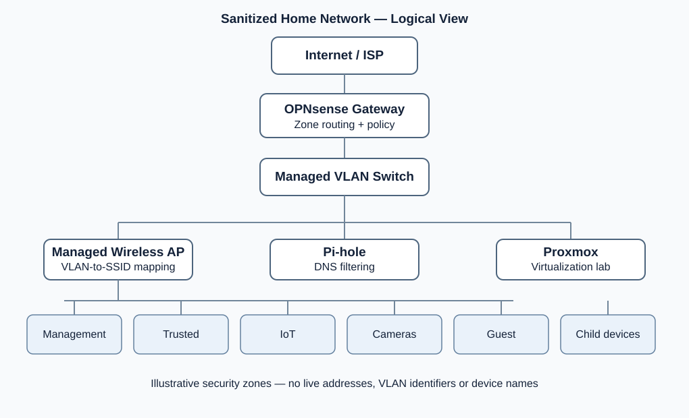

# Home Lab Security Architecture

A public, sanitized engineering case study of a segmented home network built to practice **network security architecture, defense in depth, infrastructure hardening, and verification**.

> **Scope and evidence:** This repository is a design and documentation portfolio, not a claim of a formally audited or perfectly secure network. Descriptions of deployed controls are based on the author's implementation notes. Test cases are provided as a **plan**, and should not be interpreted as passed tests until evidence is recorded.

## Architecture at a glance

The lab uses an **OPNsense** firewall on dedicated hardware, a managed VLAN-capable switch, a managed wireless access point, and a Raspberry Pi running **Pi-hole** for DNS filtering. A separate **Proxmox** host supports virtualization and future security exercises. The firewall enforces segmentation between administrative, trusted, IoT, camera, guest, and child-device zones.

## Goals

- Isolate lower-trust client groups from sensitive infrastructure.
- Limit administrative access to a dedicated management zone.
- Centralize policy enforcement and DNS filtering.
- Document rules as testable security requirements rather than relying only on screenshots.
- Practice change control, secure configuration, and repeatable verification.

## Project map

| Document | Purpose |
|---|---|
| [Architecture](docs/architecture.md) | Components, traffic paths, boundaries and assumptions |
| [Threat model](docs/threat-model.md) | Assets, attacker assumptions, threats and mitigations |
| [Segmentation](docs/network-segmentation.md) | Zone trust model and intended reachability |
| [Firewall policy](docs/firewall-policy.md) | Public-safe high-level policy matrix |
| [Validation](docs/validation-tests.md) | Reproducible test cases with unfilled results |
| [Design decisions](docs/design-decisions.md) | Why certain controls were selected and tradeoffs |
| [Example policies](examples/policy-pseudocode.md) | Vendor-neutral illustrations, not production exports |

## Implementation status

| Capability | Status | Notes |
|---|---|---|
| Dedicated OPNsense gateway | Deployed | Hardware and firmware details deliberately omitted |
| VLAN-aware switch and managed Wi-Fi | Deployed | Distinct logical networks and SSIDs |
| Management/trusted/IoT/camera/guest/child zones | Deployed | Some child-specific restrictions remain in progress |
| IoT and camera isolation | Configured | Verification cases below still need documented evidence |
| Guest internet-only access | Configured | Captive portal in use |
| Pi-hole filtering and DNS restrictions | Configured | Ongoing tuning and validation |
| Child allowlist enforcement | In progress | Do not assume full enforcement |
| Unbound integration | Planned / to verify | Do not claim active deployment |
| Remote access through WireGuard | Separate project / to verify | No claim of established end-to-end tunnel |
| SIEM / IDS tooling | Planned | Wazuh/Suricata not claimed as deployed |

## Safe disclosure

This public repository intentionally excludes real public IPs, internal address ranges, SSIDs, device names, serial numbers, MAC addresses, passwords, credentials, API tokens, VPN keys, production configuration backups, and system logs. All examples are fictional. Never commit real configuration exports without careful, manual sanitization.

## Next milestones

- [ ] Record validation evidence for zone-to-zone access tests.
- [ ] Document tested DNS behavior and failure cases.
- [ ] Finish and validate child-zone allowlisting.
- [ ] Add a separate, sanitized secure travel router case study.
- [ ] Establish a change log and re-run security checks after policy updates.

## Licensing

Documentation is provided under [CC BY 4.0](LICENSE). Example policy pseudocode is illustrative only and must be adapted and reviewed before use.
